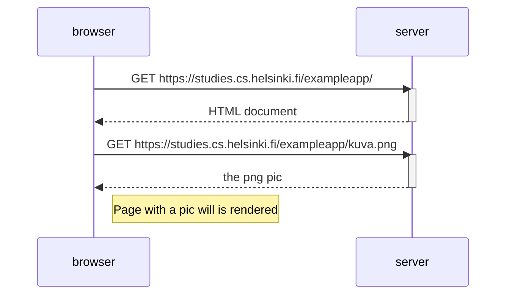
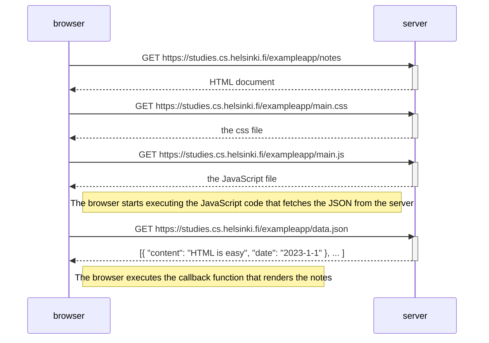
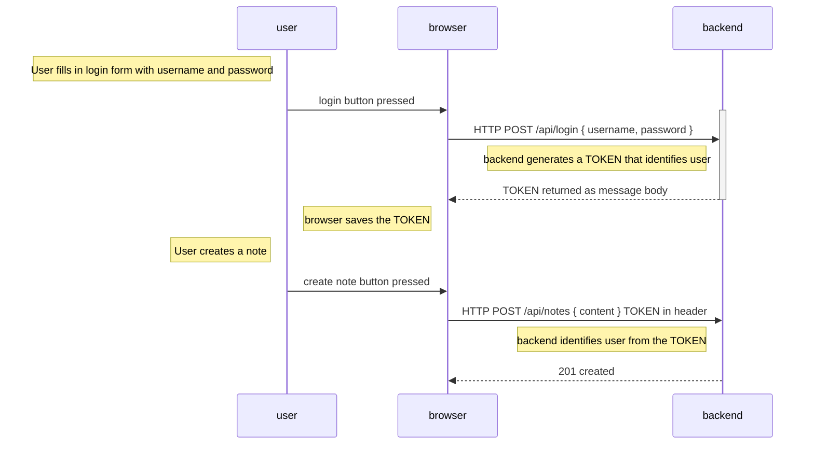

# diagrams

## part0b, 1st diagram

```mermaid
sequenceDiagram
    participant browser
    participant server
    browser->>server: GET https://studies.cs.helsinki.fi/exampleapp/
    activate server
    server-->>browser: HTML document
    deactivate server
    browser->>server: GET https://studies.cs.helsinki.fi/exampleapp/kuva.png
    activate server
    server-->>browser: the png pic
    deactivate server
    Note right of browser: Page with a pic will is rendered
```

## part0b, 2nd diagram

```mermaid
sequenceDiagram
    participant browser
    participant server
    
    browser->>server: GET https://studies.cs.helsinki.fi/exampleapp/notes
    activate server
    server-->>browser: HTML document
    deactivate server
    
    browser->>server: GET https://studies.cs.helsinki.fi/exampleapp/main.css
    activate server
    server-->>browser: the css file
    deactivate server
    
    browser->>server: GET https://studies.cs.helsinki.fi/exampleapp/main.js
    activate server
    server-->>browser: the JavaScript file
    deactivate server
    
    Note right of browser: The browser starts executing the JavaScript code that fetches the JSON from the server
    
    browser->>server: GET https://studies.cs.helsinki.fi/exampleapp/data.json
    activate server
    server-->>browser: [{ "content": "HTML is easy", "date": "2023-1-1" }, ... ]
    deactivate server    

    Note right of browser: The browser executes the callback function that renders the notes 
```

## part4d, diagram

```mermaid
sequenceDiagram
    participant user
    participant browser
    participant backend
    
    Note left of user: User fills in login form with username and password
    user->>browser: login button pressed
    
    activate backend
    browser->>backend: HTTP POST /api/login { username, password }
    
    Note left of backend: backend generates a TOKEN that identifies user
    backend-->>browser: TOKEN returned as message body
    deactivate backend
    
    Note left of browser: browser saves the TOKEN
    
    Note left of user: User creates a note
    
    user ->> browser: create note button pressed
    browser ->> backend: HTTP POST /api/notes { content } TOKEN in header
    Note left of backend: backend identifies user from the TOKEN

    backend -->> browser: 201 created
```
